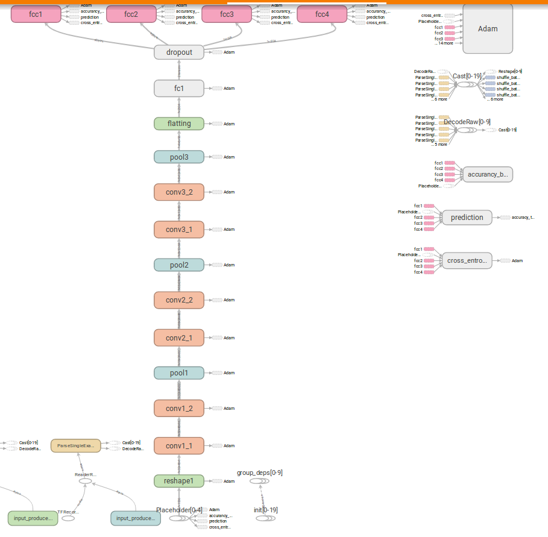
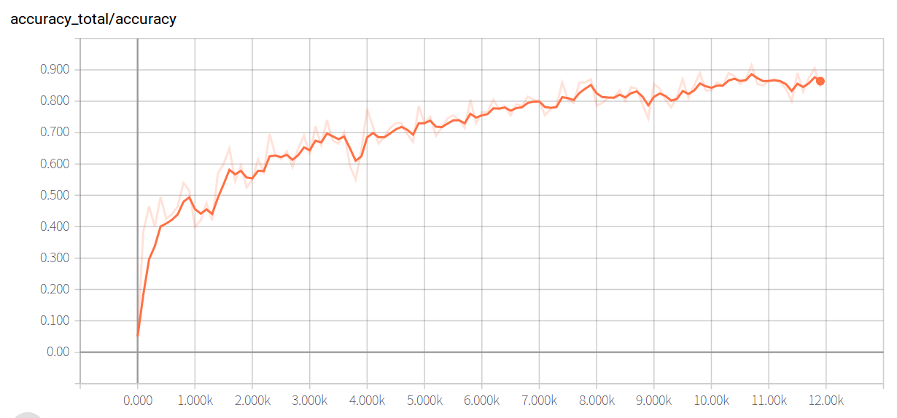
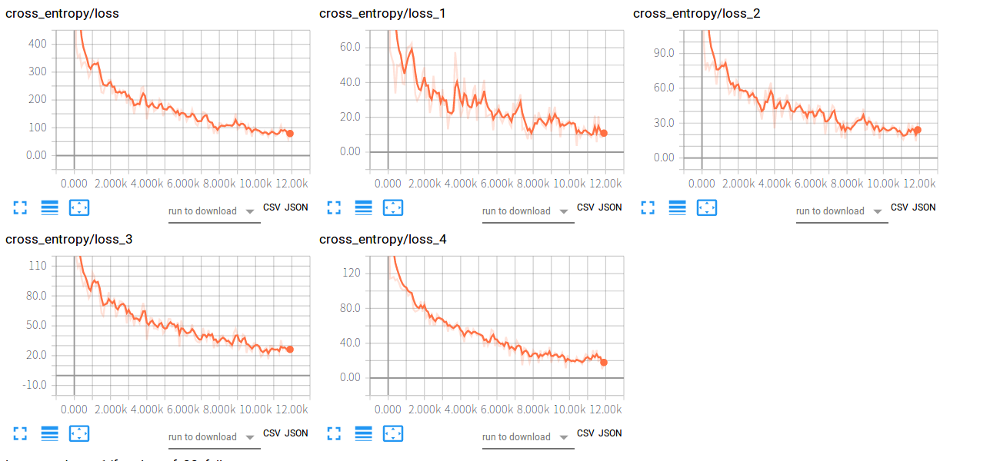

## 1.统计数据
* 一位验证码：9844；25%
* 二位验证码：5908；15%
* 三位验证码：16103；40%
* 四位验证码：8065；20%

[code](code/view_amount.py)

## 2.数据处理并制作为TFrecord文件
- [分割数据集](code/images_convert.py)
  因为给的数据集的验证码位数是所占比例是不同的，为了避免模型的训练有所侧重、偏倚，故先划分数据集，将每个数据集中每种验证码的比例设为1：1：1：1，训练集：验证集：测试集 = 8：1：1
- [制作TFrecord文件](code/convert_record.py)
  将分割好的数据集转换为TFrecord文件
  
## 3.设计模型
1. 隐藏层为以两个卷积层一个、池化层为一个组合，进行了三个组合，卷积核为2`*`2的大小，这样尽可能的提取特征的同时进行缩小参数规模。
2. 为实现端到端序列模型的实现，分出了四个输出层，分别用以输出验证码的不同位。
3. 模型参数为：75408

[code](code/nums_cnn.py)

## 4.验证模型（验证码字符识别正确率）
* 测试集正确率期望：0.9255
* 验证集正确率期望：0.9045
* 测试集正确率期望：0.8806

输出模型在训练集上正确率最高，因为在训练模型时，以其为训练集；验证集上的正确率次之，每次保存的模型为验证集的正确率较高的变量；测试集的正确率则是相对最低的。

## 5.可视化
模型图结构

验证正确率变化曲线：

代价变化曲线：

## 6.模型性能评估
testing accuracy
* 第一位正确率：0.92625
* 第二位正确率：0.87175
* 第三位正确率：0.846
* 第四位正确率：0.8785
* 验证码字符识别正确率：0.880625
* 验证码识别正确率：0.65925

## 7.API规范
* url为localhost:5000
* 点击Browser后，可选择上传验证图片，图片显示在页面后，点击upload按钮进行上传，在页面中即可显示预测结果

**[submit](code/submit.ipynb)**
