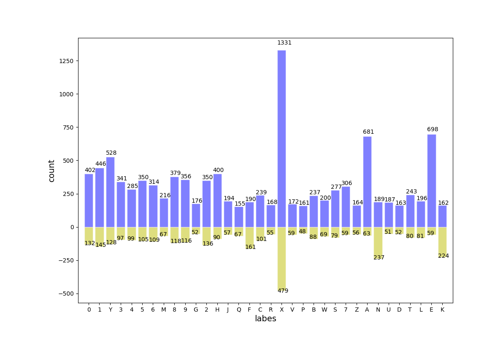

**数据分布**

**训练集验证集**：经多次检验，发现比例为3:1时，验证的正确率较高，即：75%、25%

**网络结构**

三个卷积层加池化层,激活函数为relu 一个连接层 一个输出层 

   **优化条件**：
   * 正则化：dropout
   * 滑动平均模型：tf.train.ExponentialMovingAverage
   * 激活函数更改为：prelu

**测试：**  正确率  test accuracy 0.913074

           召回率  0的召回率为0.983333  
                  1的召回率为0.968421  
                  2的召回率为1.000000  
                  3的召回率为1.000000  
                  4的召回率为0.974790  
                  5的召回率为0.992958  
                  6的召回率为0.977444  
                  7的召回率为0.992188  
                  8的召回率为0.986486  
                  9的召回率为0.959184  
                  A的召回率为0.883959  
                  B的召回率为0.790000  
                  C的召回率为0.862500  
                  D的召回率为0.768116  
                  E的召回率为0.920792  
                  F的召回率为0.800000  
                  G的召回率为0.366197  
                  H的召回率为0.946309  
                  J的召回率为0.884615  
                  K的召回率为0.808824  
                  L的召回率为0.975904  
                  M的召回率为1.000000  
                  N的召回率为0.417910  
                  P的召回率为0.937500  
                  Q的召回率为0.983333  
                  R的召回率为0.897059  
                  S的召回率为0.750000  
                  T的召回率为0.938144  
                  U的召回率为0.528571  
                  V的召回率为0.652174  
                  W的召回率为0.962963  
                  X的召回率为1.000000  
                  Y的召回率为0.975248  
                  z的召回率为0.971014  
